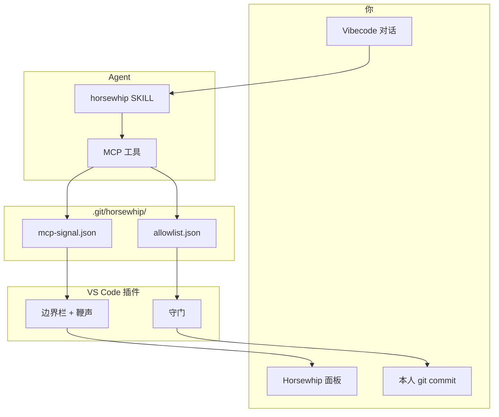
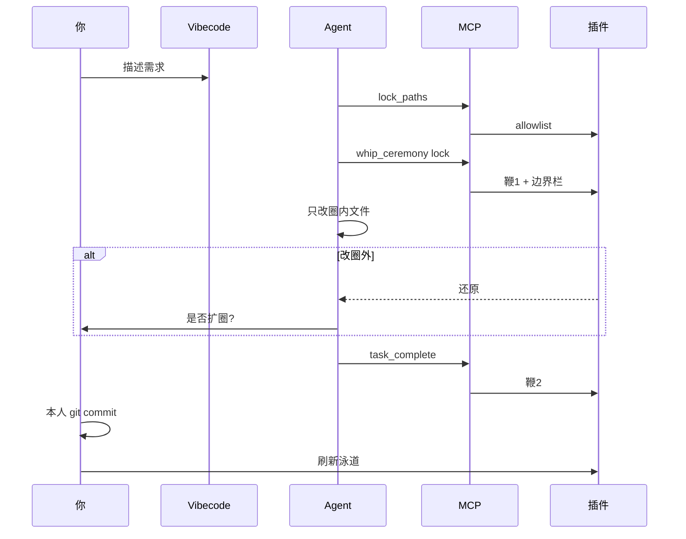

<div align="center">

# Horsewhip

**For that horse that keeps trampling your codebase**

### AI 动手前的边界尺 · 文件泳道 + 两重鞭守门

**泳道**看清动哪、哪一版。**挥鞭**圈定跑马范围。**写盘 / commit** 圈外即拦、可自动还原。  
**插件**仅上架 [VS Code 扩展市场](#安装完整版)。完整版 = **VS Code 插件 + Vibecode（MCP + Skill）**。

<br>

[](LICENSE)
[](https://github.com/waitamomentC/horsewhip/releases)
[](#安装完整版)
[](#demo)

<br>

| 痛点 | Horsewhip |
|:---:|:---:|
| AI 改飞 B、C | 圈外写盘还原，commit 兜底 |
| 不知道动了哪一版 | 泳道 **Cn** + 文件 **Vn** |
| 贴长文约束 AI | **挥鞭圈定** → 仅圈内可改 |

</div>

---

也可**只装插件**（泳道手动挥鞭），或**只配 Vibecode 的 MCP + Skill**；

均在**你的业务 Git 项目**里使用，不要在本 horsewhip 源码仓里试 Agent。

---

## 安装（完整版）

**前提：** 业务项目是 Git 仓库；本机 **Node 18+**。

| # | 操作 |
|:-:|------|
| 1 | **VS Code** → 扩展市场搜 **Horsewhip** → 安装 → 重载（插件仅上架 [Visual Studio Marketplace](https://marketplace.visualstudio.com/)，无单独 Vibecode 商店） |
| 2 | 克隆本仓库，`npm run setup:agent -- --project /path/to/your-app`（把路径换成业务项目） |
| 3 | 重载窗口 → Vibecode **MCP 设置**里启用 `horsewhip` |

```bash
git clone https://github.com/waitamomentC/horsewhip.git
cd horsewhip
npm run setup:agent -- --project /path/to/your-app
```

脚本会构建 `agent/mcp`、写入项目 MCP 配置（默认 `.cursor/mcp.json`）、链接 Skill。Windows 链 Skill 失败时加 `--copy-skill`。

`.git/horsewhip/` 为本地守门数据，**勿提交**到业务仓库。

---

## 完整版怎么用（Vibecode）

### 架构

Agent 不画 UI。MCP 写 `.git/horsewhip/`；**VS Code 插件**监听 → 守门 + 边界栏 + 鞭声。



### 一次任务



| 阶段 | Agent | 你 |
|------|-------|-----|
| 开任务 | — | Vibecode 描述需求；可开 Horsewhip 面板 |
| 圈地 | `lock_paths` | 边界栏显示路径 |
| 开工 | `whip_ceremony` lock | **第一声鞭** |
| 改码 | 只动 allowlist 内 | 圈外保存被还原 |
| 越界 | 须问你 | 同意 → `expand_boundary` |
| 收工 | `task_complete` | **第二声鞭**；**你本人 commit** |
| 换任务 | 可选 `unlock` | 泳道空白 / 解锁 |

MCP 工具：`lock_paths` · `unlock` · `get_boundary` · `expand_boundary` · `whip_ceremony` · `task_complete`（`suggest_scope` 占位）。  
Skill 细则：[agent/skills/horsewhip/SKILL.md](./agent/skills/horsewhip/SKILL.md)

---

## 两重鞭子（核心）

**未圈定 → 全库不可改；已圈定 → 仅 allowlist 内可改。**

| 鞭 | 含义 | 拦在哪 |
|----|------|--------|
| **挥鞭圈定** | 瞄准环锁定 **commit + 分支 + 路径**（或 MCP 写 allowlist） | 未圈定只读；圈外不可改 |
| **写盘守门** | 圈外或未圈定 → **`git` 还原**（含 Vibecode Agent 直写） | 可写 `edit-blocked.json` |
| **commit 兜底** | `pre-commit` + 面板提交 | 防绕过 IDE 提交 |

设置：[docs/boundary-guard.md](./docs/boundary-guard.md) · 操作细节：[docs/user-guide.md](./docs/user-guide.md)

---

## 能做什么

| 时机 | 能力 |
|------|------|
| 圈地 | 挥鞭或 MCP lock |
| 事中 | 两重鞭；越界还原 |
| 事后 | 刷新泳道，看 **Cn / Vn** |
| 预览 | 检出并运行 → 恢复工作区 |

---

## Not GitGraph

| | GitGraph | Horsewhip |
|---|----------|-----------|
| 问题 | 分支 merge | **AI 会不会改飞** |
| 横轴 | commit 时间 | **上传序 Cn** |
| 纵轴 | 分支 | **文件泳道** |

---

## Web Demo

无插件、无守门：`git clone … && open index.html`

---

## Demo

> 视频即将发布。

---

## Documentation

| 文档 | 内容 |
|------|------|
| [docs/user-guide.md](./docs/user-guide.md) | 泳道与挥鞭 |
| [docs/boundary-guard.md](./docs/boundary-guard.md) | 守门 |
| [agent/README.md](./agent/README.md) | MCP / 脚本 |
| [extension/README.md](./extension/README.md) | 插件 |

---

## For Developers

```bash
npm run build:extension
npm run build:mcp
npm run setup:agent -- --project /path/to/your-app
```

`extension/` 目录 **F5** 调试。

---

## 软著与国内 Git 登记（简要）

- **`git commit` / `push` 请本人完成**，勿让 Vibecode Agent 代提交。
- 材料可用：挥鞭圈定、越界拦截、泳道截图。

---

## License

[GNU AGPL-3.0](./LICENSE)

---

<div align="center">

**[github.com/waitamomentC/horsewhip](https://github.com/waitamomentC/horsewhip)**

*两重鞭 · VS Code 插件 + Vibecode 完整版*

</div>
