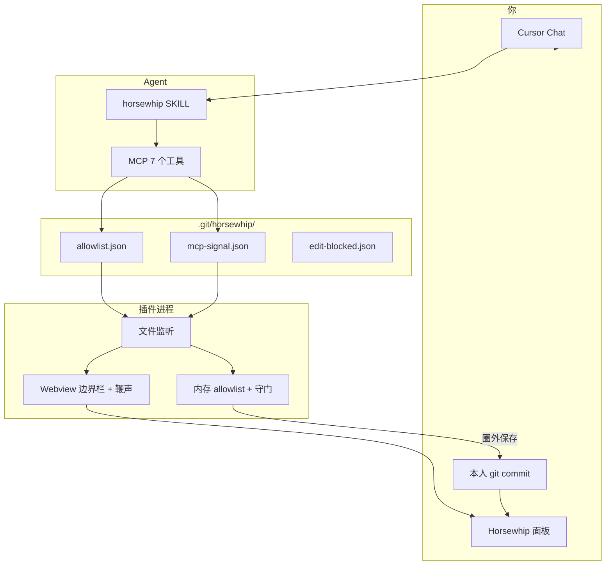
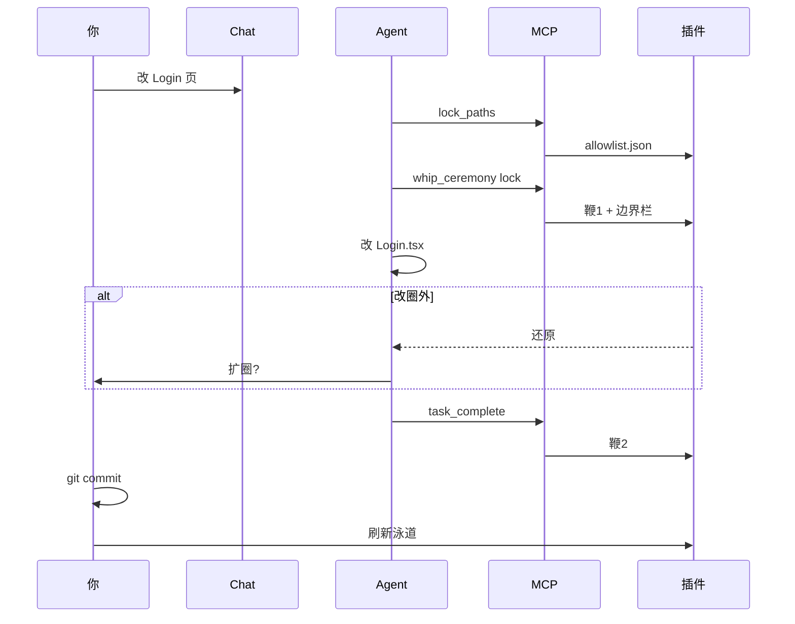
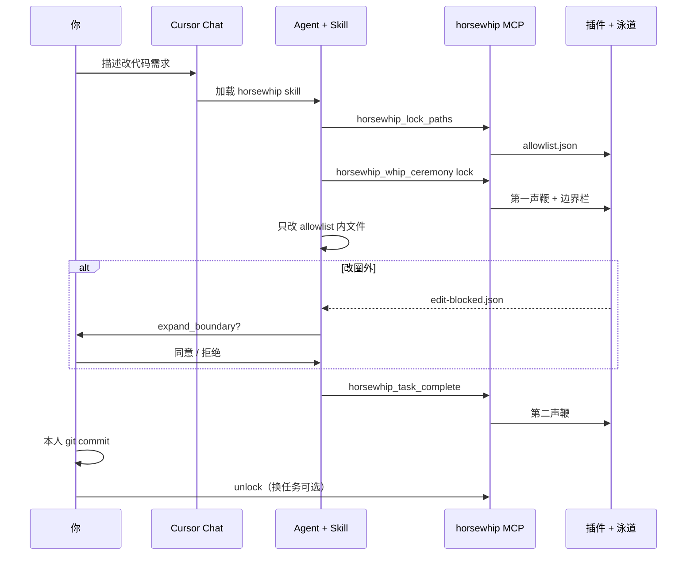

<div align="center">

# Horsewhip

**For that horse that keeps trampling your codebase**

### AI 动手前的边界尺 · 文件泳道 + 两重鞭守门

**泳道**看清动哪、哪一版。**挥鞭**圈定跑马范围。**写盘 / commit** 圈外即拦、可自动还原。  
适用 **VS Code · Cursor**（插件）；Cursor 可加 **MCP + Skill** 让 Agent 自动圈地。

<br>

[](LICENSE)
[](https://github.com/waitamomentC/horsewhip/releases)
[](#install-extension)
[](#agent-完整流程cursor)
[](#demo)

<br>

| 痛点 | Horsewhip |
|:---:|:---:|
| AI 改飞 B、C | 圈外写盘还原，commit 兜底 |
| 不知道动了哪一版 | 泳道 **Cn** + 文件 **Vn** |
| 贴长文约束 AI | **挥鞭圈定** → 仅圈内可改 |

</div>

---

## 三种用法

| 模式 | 安装 | 谁圈地 | 面板 / 鞭声 |
|------|------|--------|-------------|
| **手动** | 仅插件 | 你在泳道点选 → 挥鞭 | 有 |
| **完整版** | 插件 + MCP + Skill | Agent `lock_paths` + 仪式鞭 | 有（与手动共用 allowlist） |
| **轻量 Agent** | MCP + Skill | Agent 写 allowlist | 无泳道、无鞭声 |

均在**你的业务 Git 项目**里用，不是在本 horsewhip 源码仓里试 Agent。

---

## 快速安装（完整版 · Cursor）

**前提：** 业务项目已是 Git 仓库；本机已装 **Node 18+**。

| # | 做什么 | 耗时 |
|:-:|--------|------|
| 1 | 扩展市场安装 **Horsewhip** 插件 → 重载 | ~1 分钟 |
| 2 | 克隆 horsewhip（或已有克隆） | 一次 |
| 3 | 跑 **一键脚本**（见下） | ~1 分钟 |
| 4 | Cursor **Reload Window** → 设置里确认 MCP `horsewhip` 已启用 | 一次 |

### 方式 A · 一键脚本（推荐）

在 **horsewhip 仓库根目录**执行（把 `/path/to/your-app` 换成业务项目路径）：

```bash
git clone https://github.com/waitamomentC/horsewhip.git
cd horsewhip
npm run setup:agent -- --project /path/to/your-app
```

或在 **业务项目根目录**执行：

```bash
node /path/to/horsewhip/scripts/setup-cursor-agent.mjs --project .
```

脚本会自动：

- `npm install` + `build` → `agent/mcp/dist/index.js`
- 写入业务项目 `.cursor/mcp.json`（合并已有配置）
- 链接 `agent/skills/horsewhip` → `.cursor/skills/horsewhip`

Windows 若链接失败，加 `--copy-skill`：

```bash
npm run setup:agent -- --project C:\path\to\your-app --copy-skill
```

### 方式 B · npx（npm 发布后）

发布 `@horsewhip/mcp-server` 后，业务项目 `.cursor/mcp.json` 可写成：

```json
{
  "mcpServers": {
    "horsewhip": {
      "command": "npx",
      "args": ["-y", "@horsewhip/mcp-server"],
      "env": { "HORSEWHIP_WORKSPACE": "${workspaceFolder}" }
    }
  }
}
```

仍须自行挂上 Skill（或再跑方式 A 只链 skill）。一键脚本加 `--use-npx` 可生成上述配置。

维护者发布 MCP：`cd agent/mcp && npm publish --access public`（需 npm 账号）。

### 方式 C · 全手动

见 [Agent 完整流程 → 手动安装](#agent-手动安装)。

### 装完自检

| 检查 | 预期 |
|------|------|
| 业务项目有 `.cursor/mcp.json` | 含 `horsewhip` |
| 业务项目有 `.cursor/skills/horsewhip` | 链到或复制了 SKILL.md |
| Cursor → MCP | `horsewhip` 绿点 / 已连接 |
| 侧栏 Horsewhip | 泳道能打开 |
| Chat 试一句 | 「按 horsewhip 先 lock `某文件` 再改」→ 应调 MCP 工具 |

---

## Quick Start（手动 · 3 步）

| # | 操作 |
|:-:|------|
| 1 | [安装插件](#install-extension) → 重载 → 打开 Git 项目文件夹 |
| 2 | 侧栏 **Horsewhip** → 点选节点 → **挥鞭圈定**（瞄准环 = 仅此可改） |
| 3 | AI 只在圈内改 → **你本人** `git commit` → 面板 **刷新 Git 记录** |

元数据在 `.git/horsewhip/`（`allowlist.json` 等），**勿提交**到业务仓库。  
详细步骤：[docs/user-guide.md](./docs/user-guide.md)

---

## Agent 完整流程（Cursor）

安装请用上一节 [快速安装](#快速安装完整版--cursor)。下面为协作原理与手动备选。

### Agent 手动安装

| # | 操作 |
|:-:|------|
| 1 | [安装插件](#install-extension) |
| 2 | `cd agent/mcp && npm install && npm run build` |
| 3 | 业务项目 `.cursor/mcp.json`：`node` + `…/agent/mcp/dist/index.js`，`HORSEWHIP_WORKSPACE`: `${workspaceFolder}` |
| 4 | `ln -sf …/agent/skills/horsewhip .cursor/skills/horsewhip` |
| 5 | Reload Window |

说明：[agent/README.md](./agent/README.md) · [agent/mcp/README.md](./agent/mcp/README.md)

### 完整版怎么协作（架构）

Agent **不直接画 UI**。MCP 只写磁盘；插件监听后守门 + 更新泳道面板。



### 对话时序（一次任务）



<details>
<summary>展开：含 Skill / unlock 的完整时序</summary>



</details>

### 步骤对照（完整版）

| 阶段 | Agent（MCP） | 你看到 / 你做 |
|------|----------------|----------------|
| 开任务 | — | Chat 描述需求；可开着 Horsewhip 面板 |
| 圈地 | `lock_paths` | 边界栏出现路径列表 |
| 开工鞭 | `whip_ceremony` phase=`lock` | **第一声鞭** |
| 改码 | 只动圈内 | 圈外保存被还原 |
| 越界 | 应停下问你 | 同意 → `expand_boundary`；拒绝 → 只改圈内方案 |
| 收工 | `task_complete` | **第二声鞭**；Agent **不代 commit** |
| 收尾 | 可选 `unlock` | 你 `git commit` → 刷新泳道；空白处 / 解锁按钮可解除圈定 |

Chat 可加一句：「按 horsewhip 流程，先 lock 再改。」

### MCP 工具一览

| 工具 | 作用 |
|------|------|
| `horsewhip_lock_paths` | 写 allowlist，`locked: true` |
| `horsewhip_whip_ceremony` | 圈定 / 扩圈鞭声 + UI |
| `horsewhip_task_complete` | 收工鞭声 + 提示 |
| `horsewhip_expand_boundary` | 用户同意后合并路径 |
| `horsewhip_get_boundary` | 读 allowlist、拦截标记 |
| `horsewhip_unlock` | 清空圈定 |
| `horsewhip_suggest_scope` | 路径建议（占位，4B） |

### 为什么 MCP 和插件不一样？

| 问题 | 回答 |
|------|------|
| 插件能市场一键，MCP 呢？ | 用 [方式 A 脚本](#方式-a--一键脚本推荐) 或 [方式 B npx](#方式-b--npxnpm-发布后)；Cursor 仍要在 MCP 列表里**启用**一次。 |
| 只挂 Skill 行吗？ | **不行**。Skill 教流程；工具在 MCP 进程里。 |
| AI 能代装吗？ | 可让 Agent 跑 `npm run setup:agent`；**不能**替你在 Cursor 里批准 MCP（安全策略）。 |
| 为何不和插件打成一个包？ | MCP 写盘、插件监听 + UI；分离后无面板也能圈地。插件内置 MCP 在规划中。 |

---

## 两重鞭子（核心）

**规则：** 未圈定 → 全库不可改；已圈定 → 仅 `allowlist` 内路径可改。

| 鞭 | 精确含义 | 拦截点 |
|----|----------|--------|
| **第一重 · 挥鞭圈定** | 泳道选定节点 → 瞄准环锁定 **commit + 分支 + 路径**（或 MCP 写同一份 allowlist） | 未圈定：编辑器只读；已圈定：圈外不可改 |
| **第二重 · 写盘守门** | 监听保存（含 Agent 直写）；圈外或未圈定 → **`git` 还原** | 不等 commit；可写 `edit-blocked.json`，提示先问用户是否扩圈 |
| **兜底 · commit** | `pre-commit` + 面板提交；分支与圈定一致 | 防终端 `--no-verify` 以外绕过 |

圈定 = `allowlist.json`（机器可读）。不必再贴长约束进 Chat。  
设置：[docs/boundary-guard.md](./docs/boundary-guard.md)

**手动 vs Agent 圈地**

| | 手动挥鞭 | MCP `lock_paths` |
|--|----------|------------------|
| 写入 | 插件，`lockSource: webview` | MCP，`lockSource: mcp` |
| 泳道瞄准环 | 有（点节点） | 路径能对上节点时可能有 |
| 边界栏 / 文件轨 | 有 | 有 |
| 解锁 | 泳道空白 / 边界栏 | `unlock` 或同上 |

---

## 能做什么

| 时机 | 能力 |
|------|------|
| 圈地 | 挥鞭或 MCP lock；当前分支泳道高亮 |
| 事中 | 两重鞭守门；越界还原 |
| 事后 | 刷新泳道，看 **Cn / Vn** |
| 预览 | 节点 **检出并运行** → **恢复工作区** |

---

## Install Extension

| 方式 | 操作 |
|------|------|
| 市场 | 搜 **Horsewhip** → 安装 → 重载 |
| Release | [Releases](https://github.com/waitamomentC/horsewhip/releases) → 从 VSIX 安装 |
| 开发 | 克隆 → `npm run build:extension` → 打开 `extension/` → **F5** |

打开 **你的 Git 项目** → 活动栏 **Horsewhip**。

---

## Demo

> 视频即将发布：点选 → 挥鞭 → Agent 越界被还原 → commit → 新节点。

先按 [Quick Start](#quick-start手动--3-步) 或 [Agent 流程](#agent-完整流程cursor) 本地体验。

---

## Not GitGraph

| | GitGraph | Horsewhip |
|---|----------|-----------|
| 问题 | 分支怎么 merge | **AI 会不会改飞** |
| 横轴 | commit 时间 | **上传序 Cn** |
| 纵轴 | 分支 | **文件泳道** |

底层仍是 `git log`；界面面向改码边界，不教 Git 课。

---

## Web Demo

无插件、无守门，只看泳道：

```bash
git clone https://github.com/waitamomentC/horsewhip.git
cd horsewhip && open index.html
```

---

## Documentation

| 文档 | 内容 |
|------|------|
| [docs/user-guide.md](./docs/user-guide.md) | 手动操作 |
| [docs/boundary-guard.md](./docs/boundary-guard.md) | 守门设置 |
| [agent/README.md](./agent/README.md) | MCP + Skill |
| [agent/skills/horsewhip/SKILL.md](./agent/skills/horsewhip/SKILL.md) | Agent 工作流（英文） |
| [extension/README.md](./extension/README.md) | 插件 / 上架 |

---

## For Developers

```bash
git clone https://github.com/waitamomentC/horsewhip.git
cd horsewhip && npm install
npm run build:extension   # web → extension/media → tsc
npm run build:mcp         # agent/mcp → dist/
npm run setup:agent -- --project /path/to/your-app   # MCP + skill + .cursor/mcp.json
```

改 `src/` 或 `style.css` 后重跑 `build:extension`，**F5** 调试 `extension/`。

---

## Version

| 项 | 说明 |
|----|------|
| 插件 | `extension/package.json`（如 1.0.20+） |
| 本地 | `.git/horsewhip/` 勿提交 |

---

## 软著与国内 Git 登记（简要）

- 边界由**插件本地**执行；`.git/horsewhip/` 一般不进业务提交。
- **`git commit` / `push` 请本人在本机完成**，勿让 Agent 代提交（易出现 `Co-authored-by: Cursor` 等，与「著作权人仅为本人」材料冲突）。
- Agent 可在圈内改文件；**写入版本历史**留给人。
- 材料可用：挥鞭圈定、越界拦截、泳道截图。

---

## License

[GNU AGPL-3.0](./LICENSE)

---

<div align="center">

**[github.com/waitamomentC/horsewhip](https://github.com/waitamomentC/horsewhip)**

*两重鞭 · 圈地即守门 · 手动挥鞭或 Agent MCP*

</div>
