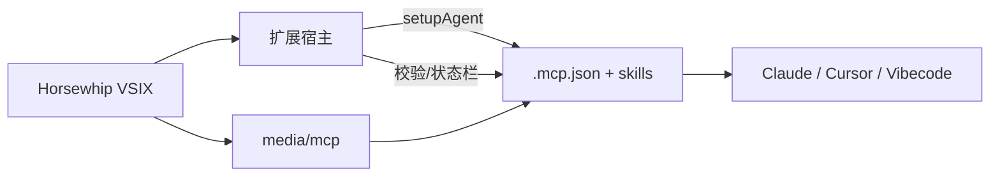

# Horsewhip Agent 配置指南

完整版 = **VS Code 插件** + **MCP Server** + **Skill**。2.1.x 起 MCP 与 Skill **内嵌在插件 VSIX**，由扩展一键写入项目，无需 clone 产品仓。

---

## 推荐流程（用户）

| 步骤 | 操作 |
|:----:|------|
| 1 | Marketplace 安装 **Horsewhip** 并重载 |
| 2 | 打开 **Git 业务项目** |
| 3 | 命令面板 → **Horsewhip: 配置 Agent（MCP + Skill）** |
| 4 | 点 **重载窗口** |
| 5 | Cursor/Vibecode：MCP 设置确认 `horsewhip` 已启用 |
| 6 | Claude Code：退出并重进 `claude` 会话 → `/mcp` 批准 |

状态栏左侧会显示 **Agent 就绪** / **未配置** / **需更新**；点击可诊断或配置。

---

## 扩展写入的文件

| 路径 | 用途 |
|------|------|
| `.cursor/mcp.json` | Cursor / Vibecode MCP（`${workspaceFolder}`） |
| `.mcp.json` | Claude Code MCP（`${CLAUDE_PROJECT_DIR}`，`alwaysLoad: true`） |
| `.cursor/skills/horsewhip/` | Cursor Skill |
| `.claude/skills/horsewhip/` | Claude Skill |
| `.git/horsewhip/agent-setup.json` | 配置审计戳（版本、哈希、时间，**勿提交**） |

MCP 环境变量：

- `HORSEWHIP_MCP_VERSION` — 与插件版本一致  
- `HORSEWHIP_MCP_HASH` — 内嵌 `dist/index.js` 的 SHA256  

---

## 插件设置

| 设置 | 默认 | 说明 |
|------|------|------|
| `horsewhip.agent.validateOnOpen` | `true` | 打开 Git 项目时校验 MCP 配置 |
| `horsewhip.agent.autoFixOnUpgrade` | `true` | 插件升级后自动重写过期 MCP 配置 |

关闭自动校验后，可手动运行 **Horsewhip: 诊断 Agent 配置**（输出面板「Horsewhip Agent」）。

---

## 升级 / 重装插件后

1. 打开业务项目 → 扩展检测版本/路径/哈希  
2. **autoFixOnUpgrade** 开启时：自动更新 `.mcp.json` 等 → 提示重载  
3. 否则弹窗：**立即配置** / **诊断详情** / **稍后**  
4. 收到 MCP 信号但配置过期时，扩展会警告（避免 Cursor 仍连旧 MCP）

---

## 开发者 / CI 备选

```bash
cd horsewhip
npm run build:extension
npm run setup:agent -- --project /path/to/app --from-extension ./extension
```

仍会从扩展包内 `media/mcp/` 取 MCP，并写入版本/哈希 pin。

---

## 故障排查

| 现象 | 处理 |
|------|------|
| 状态栏「未配置 Agent」 | 运行 **配置 Agent** |
| 状态栏「MCP 已阻断」 | 哈希篡改；运行 **配置 Agent** 并重载，勿手改 hash |
| Claude 无工具 | 见 [claude-code.md](./claude-code.md) |
| MCP 有信号无鞭声 | 确认 VS Code 插件已装且面板/宿主在线 |
| 仅插件无 Agent | 可跳过 MCP；泳道内手动挥鞭 |

---

## 6. 完整性校验与篡改响应（2.1.2+）

检测到 **`stale_hash`** 时：

| 层 | 行为 |
|----|------|
| **MCP 进程** | 启动时比对 `HORSEWHIP_MCP_HASH` 与 `index.js` SHA256；不匹配 **exit(1)** |
| **扩展** | **模态弹窗**；状态栏 **MCP 已阻断**；不静默改 hash |
| **MCP 桥** | 忽略 MCP 信号；拒绝 `lockSource: mcp` 的 allowlist 同步 |
| **审计** | `.git/horsewhip/mcp-trust-blocked.json` |

含 `stale_hash` **不会**走 `autoFixOnUpgrade`；须用户运行 **配置 Agent** 并重载。

---

## 架构（分发）



详见 [trust-model.md §8](./trust-model.md#8-mcp-分发已知弱点与目标形态)。

---

*horsewhip · Agent 分发 · 2.1.x*
