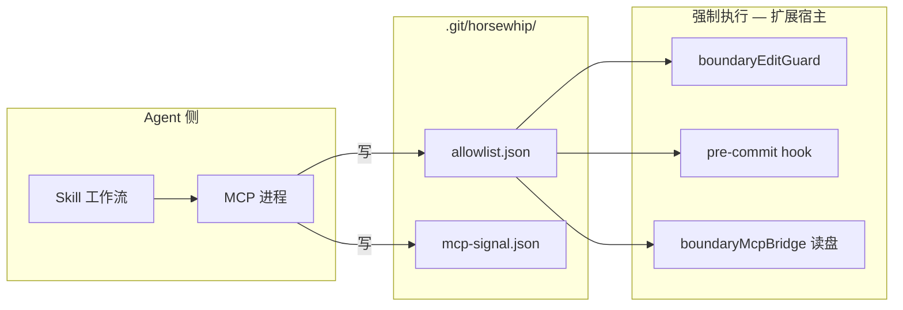
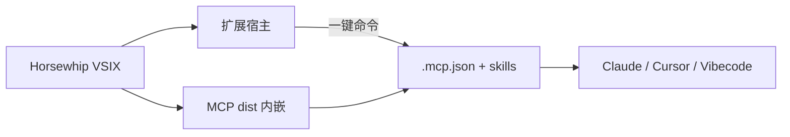

# Horsewhip 信任模型与已知限制

> **读者**：产品、Agent 集成、安全评审。  
> **结论先行**：Phase 4A 的 MCP + Skill 是 **协作纪律层**，不是沙箱。在同一台机器、同一文件系统上，拥有写盘能力的 Agent **不能**被 MCP 进程 alone 硬性拦住；真正执行守门的是 **VS Code 扩展 + `.git/horsewhip/` 数据 +（可选）pre-commit hook**。

---

## 1. 组件各自干什么

| 组件 | 角色 | 能否单独「强制」边界 |
|------|------|---------------------|
| **Skill** | 告诉 Agent 先 lock、再改、越界要问 | 否（软约束） |
| **MCP** | 程序化写 `allowlist.json` / 信号 | 否（只是写文件的客户端） |
| **扩展** | 读 allowlist → 编辑锁 / 还原 / commit 拦截 | **是（在 IDE 路径上）** |
| **pre-commit** | 终端 `git commit` 兜底 | **部分**（可 `--no-verify`） |

**常见误解**：以为「边界规则跑在 MCP 里」。实际上 MCP 的 `persist.ts` 与扩展的 `boundaryPersist.ts` 写的是 **同一份** `allowlist.json`；扩展 **不执行** MCP 里的 TypeScript，只认磁盘上的 JSON。

---

## 2. 「信任悖论」是否成立？

**成立，但要精确表述：**

- 问题不只是「AI 能读到 MCP 源码」。
- 本质是：**所有 enforcement 都依赖可被 Agent 改写的本地状态**（allowlist、hook、扩展安装目录、MCP 的 `node dist/index.js`）。
- 改 MCP 让 `persistAllowlist` 永远写 `locked: false`，与 **Agent 直接用 Write 工具改 `allowlist.json`** 效果相同，甚至不必碰 horsewhip 仓库。

因此：

| 攻击方式 | 难度 | 结果 |
|----------|------|------|
| 篡改 `agent/mcp/dist/*.js` 或 `persist.ts` 后重载 MCP | 中 | MCP 不再写有效 lock；若扩展仍读旧 allowlist，短暂仍有效 |
| 直接改 `.git/horsewhip/allowlist.json` | **低** | 扩展按新 allowlist 守门（或解锁） |
| 改 `.git/hooks/pre-commit` | 低 | 终端 commit 兜底失效 |
| `git commit --no-verify` | 低 | 绕过 hook |
| 终端 / 外部编辑器改文件（不经 VS Code） | 中 | 取决于 `revertOnWrite`、`blockEdit` |
| 改 VS Code 扩展 `extension/out/*.js` | 中 | 整条 IDE 守门链失效 |

**Phase 4A 设计目标**（见 `plan.md`）：Agent **discipline** + 与插件联动，**不是** TEE / 远程 attestation 级隔离。

---

## 3. 篡改 MCP 后，什么还能挡？

假设 **扩展未篡改**、用户仍用官方 VS Code 扩展：

1. **已有有效 `allowlist.json` 且 `locked: true`**  
   扩展仍按磁盘 allowlist 做编辑锁 /（若开启）写盘还原 / commit 拦截。  
   MCP 被改只影响 **新的** lock/unlock 调用，不自动撤销旧锁。

2. **MCP 被改后不再 lock**  
   Agent 可跳过 lock 直接改文件 → 若当前 **未 locked**，扩展默认 `shouldBlockEdit` **不拦**（见 `boundaryEditGuard.ts`：`!locked` → `block: false`）。  
   这是产品与文档需要对齐的一点：**未圈定 ≠ 默认全库只读**（README 部分表述仍偏严格）。

3. **Skill 仍有效**  
   对「会读 Skill 的合规 Agent」仍有行为约束；对故意绕过的 Agent 无效。

---

## 4. 方案评估（诚实版）

| 方案 | 能缓解什么 | 不能解决什么 | 建议 |
|------|------------|--------------|------|
| **MCP 二进制签名校验** | 防 **无意/恶意** 改 MCP：`stale_hash` 弹窗阻断 + MCP 进程拒绝启动 | Agent 仍可直改 allowlist（若不经 MCP） | ✅ 2.1.2：`mcpTrustGate` + `integrity.ts` |
| **MCP 装到系统路径** | 提高改 MCP 成本 | allowlist / hook / 业务文件仍可写 | 完整版文档推荐 `--global-claude` / 全局 MCP |
| **扩展端交叉验证 lockSource** | 发现 MCP 与 UI 状态不一致时告警 | 不能防 Agent 直写 JSON | 可做：unlock 必须经 webview 或用户确认 |
| **allowlist 完整性（HMAC / 签名）** | 扩展只信带签名的 allowlist 变更 | 密钥仍在本地，Agent 可偷 | 中等成本，适合「防误改」多于「防恶意 Agent」 |
| **把 horsewhip 源码目录圈进 allowlist** | 几乎无（鸡生蛋：锁了无法维护 horsewhip 仓） | 业务项目 MCP 路径不在 allowlist 内 | **不推荐**作为主方案 |
| **审计日志 + 用户通知** | 异常 unlock / 大面积 allowlist 变更可见 | 不阻止，只发现 | 性价比高，建议 Phase 4B |
| **远程 MCP / 策略服务** | 策略与密钥不在业务仓库 | 运维与离线成本 | 企业版方向 |

**没有银弹**：在同一用户权限下，**恶意 Agent ≡ 恶意本地用户**。Horsewhip 的价值是 **默认合规工作流 + IDE 内即时反馈 + Git 兜底**，不是 DRM。

---

## 5. 用户/团队可做的「实用加固」（现在就能做）

1. **完整版**：业务项目用扩展 + MCP + Skill；`blockEdit: lock` + `revertOnWrite: true`（设置见 `boundary-guard.md`）。
2. **MCP 来源**：用 `npm run setup:agent` 指向 **只读** 的 horsewhip 克隆，或发布后 `npx @horsewhip/mcp-server` + 扩展 pin 版本哈希。
3. **Git hook**：打开仓库时自动装 pre-commit；CI 再跑 allowlist 与 diff 对照（未来）。
4. **流程**：要求 Agent **必须** `lock_paths` 后再改；人看 `.git/horsewhip/allowlist.json` 与泳道是否一致。
5. **别把 `--no-verify` 写进 Skill 允许项**（已在 Skill 禁止）。

---

## 6. 产品 backlog（建议）

| 优先级 | 项 | 说明 |
|--------|-----|------|
| P1 | **文档与实现一致** | 「未圈定是否可改」统一 README / guard / 用户指南 |
| P1 | **allowlist 变更审计** | 扩展记录 lock/unlock/expand 来源与时间；异常 unlock toast |
| P1 | **插件一键 Agent 配置** | ✅ 2.0.8：`horsewhip.setupAgent` |
| P2 | **VSIX 内嵌 MCP 产物** | ✅ 2.0.8：`sync-mcp-bundle.js` → `media/mcp/` |
| P2 | **MCP 路径哈希 pin** | ✅ 2.0.9：`HORSEWHIP_MCP_HASH` + `manifest.mcpDistSha256` |
| P2 | **升级后刷新 MCP 路径** | ✅ 2.0.9：打开工作区校验 + 升级后强制提示 |
| P2 | **stale_hash 阻断 MCP** | ✅ 2.1.2：扩展拒信号/allowlist + MCP 启动自检 exit(1) |
| P2 | **unlock 需用户确认** | MCP `unlock` 仅写 pending；扩展弹窗确认后生效 |
| P3 | **npm 发布 `@horsewhip/mcp-server`** | 无 clone 时的 `npx` 路径；扩展生成 pin 版本 |
| P3 | **签名校验** | 与 npm / 内嵌 hash 配套 |

---

## 7. 给 Agent 集成方的说明（可引用）

> Horsewhip MCP 是 **边界状态的写入 API**，不是 **安全边界**。  
> 对「会配合 Skill 的 Agent」，它提供可审计的圈地与鞭声仪式；  
> 对「恶意或越狱 Agent」，请假设其可修改 `.git/horsewhip/` 与本地 MCP。  
> 强制力来自 **已安装的 Horsewhip VS Code 扩展** 与 **Git 钩子**，且仅在相应入口生效。

---

## 8. MCP 分发：已知弱点与目标形态

### 8.1 现状（Phase 4B–4C）

| 组件 | 如何获得 | 说明 |
|------|----------|------|
| **VS Code 插件** | Marketplace 一键装 | ✅ |
| **MCP Server** | VSIX 内 `media/mcp/` + 命令 **配置 Agent** | ✅ 与插件同版本 |
| **Skill** | 同上，复制到 `.cursor/skills` / `.claude/skills` | ✅ |
| **legacy** | clone + `setup:agent` | 开发者备选 |

**推荐路径**：装插件 → **Horsewhip: 配置 Agent（MCP + Skill）** → 重载窗口。

**2.1.0+ 完善项**：

- 状态栏 **Agent 就绪 / 需更新 / 未配置**
- 命令 **诊断 Agent 配置**（输出面板）
- 双文件校验（`.cursor/mcp.json` + `.mcp.json`）
- 升级后 **autoFixOnUpgrade** 自动重写过期配置
- `.git/horsewhip/agent-setup.json` 审计戳

仍存在的缺口：MCP 配置使用 **绝对路径**（扩展安装目录）；重装插件后扩展会提示或自动修复，但仍需 **重载窗口** 让 IDE 重连 MCP。

### 8.2 为什么是弱点（不仅是 UX）

1. **版本耦合**：插件 `boundaryMcpBridge` 与 MCP 信号格式、allowlist schema 应对齐；分叉安装易 silent break。
2. **信任链断裂**：`setup:agent` 写的绝对路径指向用户任意 clone，扩展无法断言「这是官方 MCP」。
3. **完整版名不副实**：README 写「装插件 + 配 Agent」，第二步仍要求开发者操作，非程序员门槛高。

与 [§2 信任悖论](./trust-model.md#2-信任悖论是否成立) 叠加：MCP 路径越随意，篡改 / 误配概率越高。

### 8.3 目标形态（产品共识）

**理想**：用户只装 **一个** Marketplace 插件 → 打开 Git 项目 → 命令 **「Horsewhip: 配置 Agent（MCP + Skill）」** → 扩展：

1. 用 **扩展包内** 的 `media/mcp/`（或 `agent/mcp/dist` 构建进 VSIX）作为 MCP `command` / `args`；
2. 写入项目 `.mcp.json` + `.cursor/mcp.json`（及 `.claude/skills/horsewhip`）；
3. **锁定版本**：配置里带 `horsewhipMcpVersion: "2.0.7"` 与 dist 哈希，扩展启动时校验；
4. 可选：首次打开 Git 仓库时 **提示** 一键配置（不强制）。

**仍需要 Node**：MCP 是 stdio 子进程，VS Code 扩展无法代替 Node 执行 TS；内嵌的是 **已 build 的 `index.js`**，不是「零依赖」。

### 8.4 分阶段路线（建议写进 roadmap）

| 阶段 | 交付 | 用户感知 |
|------|------|----------|
| **4B–4C（2.0.8+）** | 扩展命令 `horsewhip.setupAgent` + VSIX 内嵌 `media/mcp/` | **推荐**：装插件 → 一键配置 |
| **4A（legacy）** | clone + `setup:agent` | 开发者 / 无 Marketplace 时 |
| **4D** | npm `@horsewhip/mcp-server` + 扩展 pin；`--use-npx` 为无 VSIX 时的备选 | CI / 全局安装友好 |
| **4E** | 扩展贡献 MCP（VS Code/Cursor 稳定 API 时） | 零 `.mcp.json` 手改 |

### 8.5 不应做的

- **不要**要求用户把 horsewhip **产品仓** clone 到业务项目里才能用 MCP。
- **不要**在 Skill 里写死绝对路径；一律 `${extension}` / `${workspaceFolder}` / 扩展生成的相对路径。
- **短期不必**把 Skill 塞进 VSIX 以外的地方；`.claude/skills` / `.cursor/skills` 复制即可，关键是 **来源版本与插件一致**。

---

*horsewhip · Phase 4A 纪律层 · 非沙箱 · 最后更新：2026-05-28*
